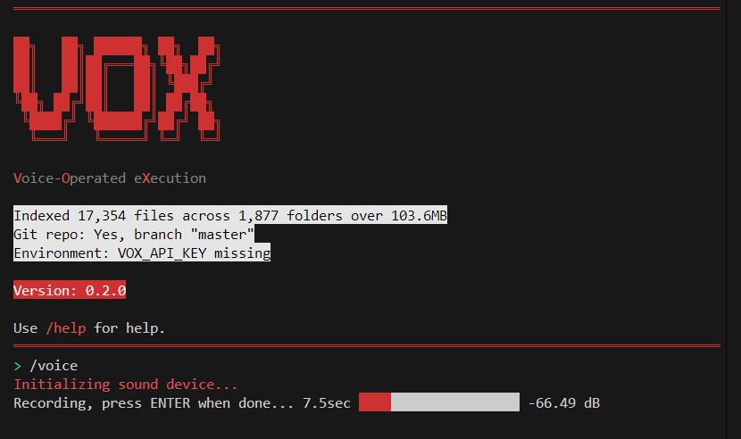

# VOX - Voice Operated eXecution



VOX is a powerful **Node.js CLI tool** that allows you to execute commands using your voice. Leveraging the capabilities of **OpenAI's Whisper** for transcription and intelligent processing, VOX provides an interactive and efficient way to interact with your system through voice commands.

## Table of Contents

- [Features](#features)
- [Prerequisites](#prerequisites)
- [Installation](#installation)
- [Configuration](#configuration)
- [Usage](#usage)
  - [Available Commands](#available-commands)
- [Contributing](#contributing)
- [License](#license)

## Features

- **Voice Input:** Record audio commands and transcribe them using OpenAI's Whisper model.
- **Interactive CLI:** User-friendly interface with colored outputs and real-time feedback.
- **Directory Indexing:** Summarizes the current directory structure, including file counts and sizes.
- **Environment Checks:** Verifies the presence of essential environment variables and Git repository status.
- **Real-time Feedback:** Visual indicators like spinners and decibel meters enhance user experience.
- **Automated Workspace Handling:** Processes commands and opens relevant workspaces in your browser.

## Prerequisites

- **Node.js:** Ensure you have Node.js (v14 or later) installed on your machine. You can download it from [Node.js Official Website](https://nodejs.org/).
- **Git:** (Optional) For version control and repository management. Download from [Git Official Website](https://git-scm.com/).

## Installation

1. **Clone the Repository**

   ```bash
   git clone https://github.com/your-username/vox.git
   cd vox
   ```

2. **Install Dependencies**

   Navigate to the project directory and install the necessary dependencies using `npm`:

   ```bash
   npm install
   ```

OR

1. **NPM Install Globally**

   ```bash
   npm install -g vox
   ```

## Configuration

1. **Environment Variables**

   VOX requires an OpenAI API key to function correctly. Create a `.env` file in the root directory of the project and add your OpenAI API key:

   ```env
   OPENAI_API_KEY=your_openai_api_key_here
   ```

   Replace `your_openai_api_key_here` with your actual OpenAI API key. If you don't have one, you can obtain it from the [OpenAI Dashboard](https://platform.openai.com/account/api-keys).

## Usage

Start the VOX CLI by running the following command:

```bash
node index.js
```

Upon starting, VOX will display an ASCII art logo, a summary of the current directory, Git repository status, and environment variable checks.

### Available Commands

Once the CLI is running, you can interact with it using the following commands:

- **/voice**

  Record audio input and save it to `voice_input.wav`. The audio will be transcribed using OpenAI's Whisper model, and the transcribed text will be processed for command execution.

  ```bash
  /voice
  ```

- **/help**

  Display the help message with a list of available commands.

  ```bash
  /help
  ```

- **/exit**

  Exit the VOX application.

  ```bash
  /exit
  ```

## Contributing

Contributions are welcome! If you'd like to contribute to VOX, please follow these steps:

1. **Fork the Repository**

   Click the "Fork" button at the top right of this page to create a copy of the repository under your GitHub account.

2. **Create a New Branch**

   ```bash
   git checkout -b feature/YourFeatureName
   ```

3. **Make Your Changes**

   Implement your feature or bug fix.

4. **Commit Your Changes**

   ```bash
   git commit -m "Add your message here"
   ```

5. **Push to Your Fork**

   ```bash
   git push origin feature/YourFeatureName
   ```

6. **Create a Pull Request**

   Navigate to the original repository and click "Compare & pull request" to submit your changes for review.

## License

This project is licensed under the [MIT License](LICENSE).

---

*Developed with ❤️ by the VOX Team*

# License

MIT License. See the [LICENSE](LICENSE) file for details.

# Acknowledgements

- [OpenAI](https://openai.com/) for providing the Whisper transcription model.
- [Node.js](https://nodejs.org/) for the robust JavaScript runtime.
- [Ora](https://github.com/sindresorhus/ora) for the elegant terminal spinner.
- [Numeral.js](http://numeraljs.com/) for number formatting.

# Support

If you encounter any issues or have questions, feel free to [open an issue](https://github.com/brngdsn/vox/issues) on the repository.

# Contact

For any inquiries or feedback, please reach out to [brn.gdsn@gmail.com](mailto:brn.gdsn@gmail.com).

---

© 2024 VOX. All rights reserved.